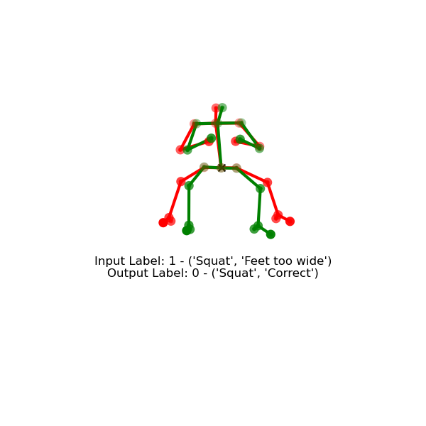
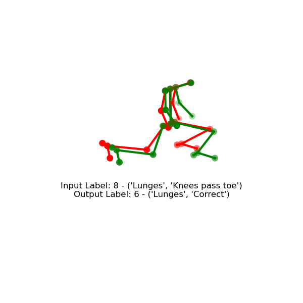
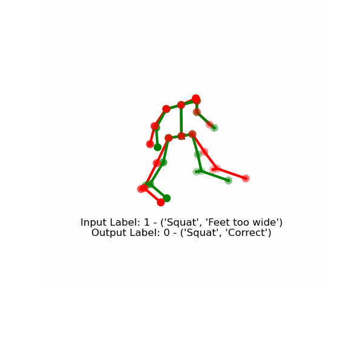
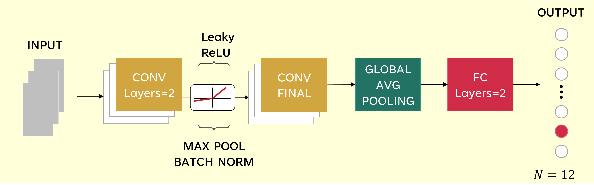
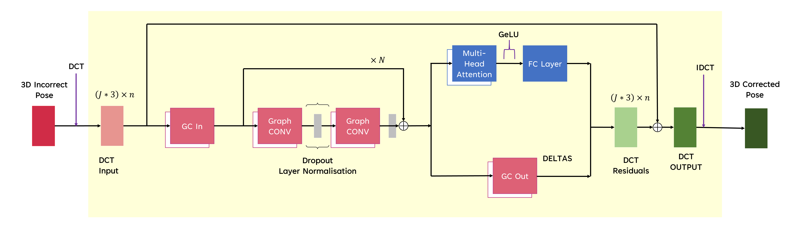

# ExerciseCorrector

## Introduction
Exercise is necessary for well-being and physical health, however, improper exercise performance can result in serious injury which is detrimental to both physical and mental health. We aim to introduce a data-driven approach to remedy this problem, we use 3D skeleton-based data, Convolutional Neural Network (CNN), Graph Convolution (GCN) and attention layers. Both 3D positional information and the frequency domain representation known as Discrete Cosine Transform (DCT) are used. Dynamic Time Warping is used for training and generating training pairs. We achieved an accuracy score of $92\%$ for identifying exercise mistakes and a $95.5\%$ correction success rate for improving the incorrect performances.

## Results
<p float="left">
    
    
</p>
<p float="left">
    
</p>

## Models
### Error Classification
<p float="left">
    
</p>

### Motion Correction
<p>
    
</p>

## Installation
```
git clone https://github.com/shaz4k/ExerciseCorrector
```
##
